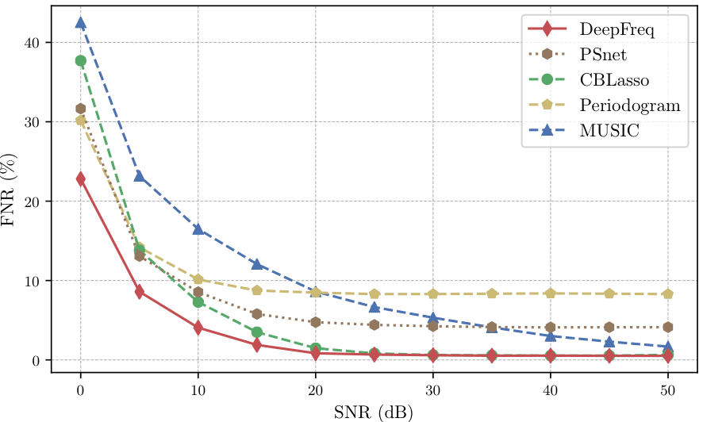
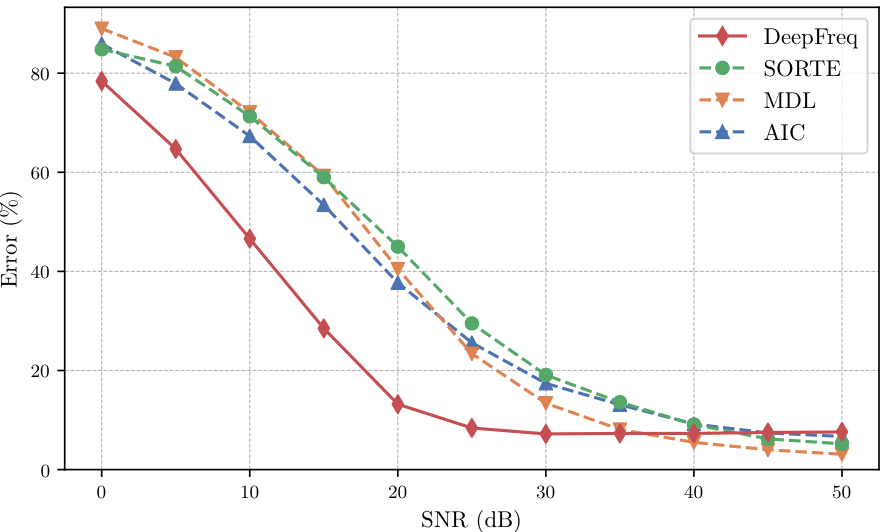

# Code and Pretrained Networks from  "Data-driven Estimation of Sinusoid Frequencies"

This repository contains information, code and models from the paper [Data-driven Estimation of Sinusoid Frequencies](https://arxiv.org/abs/1906.00823) by Gautier Izacard, Sreyas Mohan and [Carlos Fernandez-Granda](https://cims.nyu.edu/~cfgranda/).

## Frequency Estimation Problem and Proposed Solution

Frequency estimation problem is illustrated in the following figure. A multisinudoisal signal (linear combination of complex exponentials), represented by blue dashed lines and it's Nyquist rate samples, represented by blue cicles are depicted in the top row. The goal of Frequency Estimation problem is to determine the frequencies contained in the signal from it's noisy samples. The bottom row of the image shows that the resolution of the frequency estimate obtained by computing the discrete-time Fourier transform from N samples decreases as we reduce N. So signal is real values, so it's Fourier Transform is even; so only half of the coefficients are shown.
 

We introduce a deep learned based framework to perform frequency estimation from data corruped with noise of unknown strength. The approach is inspired from [PSNet](https://math.nyu.edu/~cfgranda/pages/stuff/LearningBased.pdf) which uses deep network to derive a frequency representation and then assuming tha the number of true frequencies are known, finds the peaks of the representation to perform frequency estimation. We propose an improved verison of PSNet and pair it with a Frequency Counting Module that outputs an estimate of the number of frequencies. The architecture of DeepFreq is illustrated in the figure below. First, the data is fed into a module which produces requency representation, which we call the Frequency Representation (FR) module. The first layer of FR module is a linear encoder which maps the data to an intermediate feature space, followed by several convolution and batch norm layers with ReLU non-linearity. Finally, we use transposed convolutions to produce the frequency representation (Please refer to Sec 2.2 for detailed architecture). Once the representations are generated by the FR module, it is fed into the frequency-counting module to generate an estimate of the number of sinusoids in the signal. The counting module is a convolutional neural network with the final layer being fully connected (Please refer to Sec 2.3 for details). After we get the estimated number of frequencies (m), we calculate the estimated frequencies in the input signal by locating the m higher maxima in the representation produced by FR module.
 

## Results
#### Frequency Representation
 
We compare the Frequency Representation constructed by different methods to that of DeepFreq. For this experiment, we assume that the true number of sinusoidal components, m is known. We estimate the m components by locating the m highest maxima of the frequency representations constructed by different methods from noisy data. We quanify the quality of the estimate using False Negative Rate (FNR) defined as the number of true frequencies that are undetected. (See section 3.2 for more details)

#### Frequency Counting
 
For different data points, we generate a frequency representation using the FR module of DeepFreq. Figure shows the test error of different frequency counting techniques (DeepFreq, AIC and SORTE) on the frequency representation generated using DeepFreq. Error is computed by counting the fraction of signals in the test set for which the number of components is not estimated correctly. See section 3.3 for more details)

#### Frequency Estimation
 
We evaluate the frequency-estimation performance of DeepFreq in a realistic setting where both the noise level and the number of sinusoidal components are unknown. We compare our approach to an eigendecomposition-based procedure that combines MUSIC with AIC or MDL, as well as to the CBLasso, where frequencies are selected from the dual solution using a threshold calibrated with a validation dataset. We measure estimation accuracy by computing the [Chamfer distance](https://www.sciencedirect.com/science/article/pii/0734189X84900355) between the true frequencies and the estimates. (See section 3.5 for more details)
