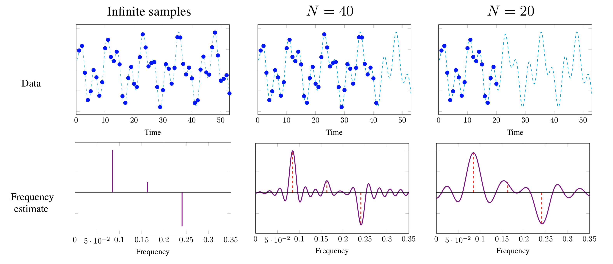
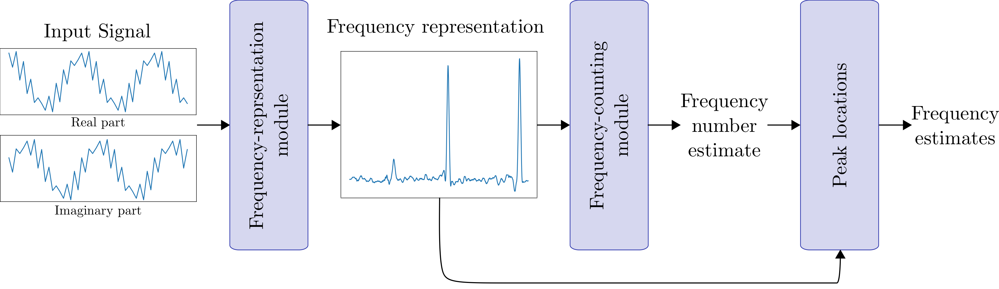
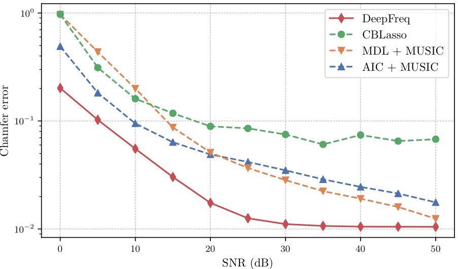

# Code and Pretrained Networks from  "Data-driven Estimation of Sinusoid Frequencies"

This repository contains information, code and models from the paper [Data-driven Estimation of Sinusoid Frequencies](https://arxiv.org/abs/1906.00823) by Gautier Izacard, Sreyas Mohan and [Carlos Fernandez-Granda](https://cims.nyu.edu/~cfgranda/).

## Frequency Estimation via Deep Learning

Frequency estimation is a fundamental problem in signal processing, with applications in radar imaging, underwater acoustics, seismic imaging, and spectroscopy. The goal is to estimate the frequency of each component in a multisinusoidal signal from a finite number of noisy samples. The estimation problem is illustrated in the following figure. The blue data are N samples from a multisinudoisal signal (blue dashed lines) sampled at the Nyquist rate. The bottom row of the image shows that the resolution of the frequency estimate obtained by computing the discrete-time Fourier transform from N samples decreases as we reduce N. To solve the frequency-estimation problem we need to super-resolve the frequency locations from the data.

 

In previous work, we proposed to perform frequency estimation by training a neural network, called a PSNet](https://math.nyu.edu/~cfgranda/pages/stuff/LearningBased.pdf), to output a learned representation with local maxima at the position of the frequency estimates. Here, we propose a novel neural-network architecture that produces a significantly more accurate representation, and combine it with an additional neural-network module trained to detect the number of frequencies. 

 

This yields a fast, fully-automatic method for frequency estimation that achieves state-of-the-art results. In particular, it outperforms existing techniques by a substantial margin at medium-to-high noise levels. The following figure compares our methodology to two subspace-based methods that use the covariance matrix of the data, and a sparse-estimation method based on convex optimization. Estimation accuracy is measured using the [Chamfer distance](https://www.sciencedirect.com/science/article/pii/0734189X84900355) between the true frequencies and the estimates. 

 

